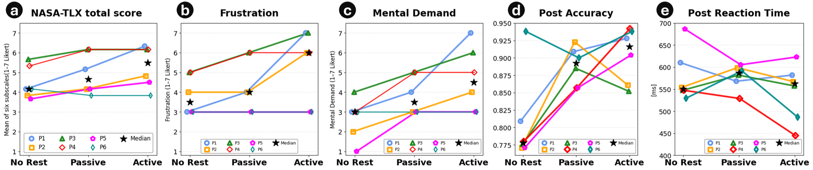

# PAWSE: A Laptop-Peripheral Robot Supporting Micro-Breaks Through Fidgeting-Based Tangible Interaction
Supplementary materials for PAWSE (ACM HRI 2026): additional figures for results and video.

(a) NASA-TLX total score (mean of six 7-point Likert subscales: Mental Demand, Physical Demand, Temporal Demand, Performance, Effort, and Frustration). (b) Frustration. (c) Mental demand. (d) Post-task accuracy. (e) Post-task reaction time (RT) across rest conditions. *Note that NASA-TLX scores were reverse-coded where necessary (higher = more positive).

Demonstration Video

Figures and supplementary materials in this repository are licensed under CC BY 4.0.
